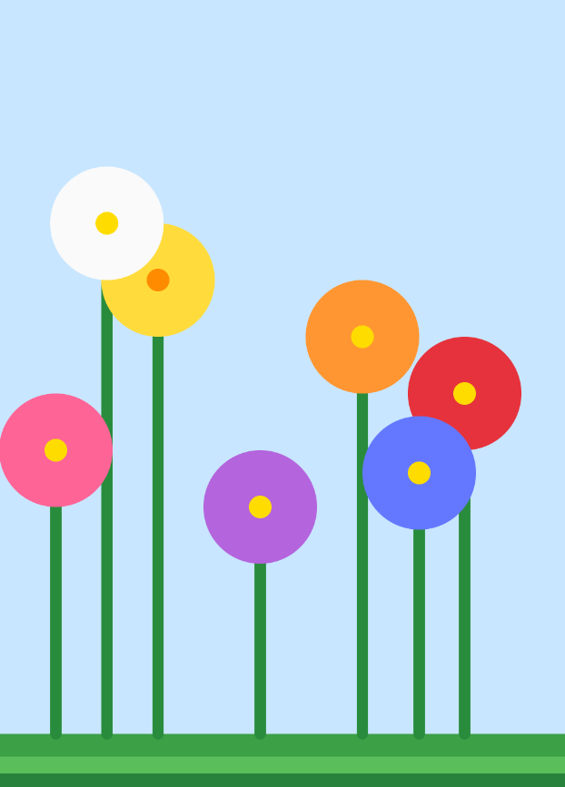
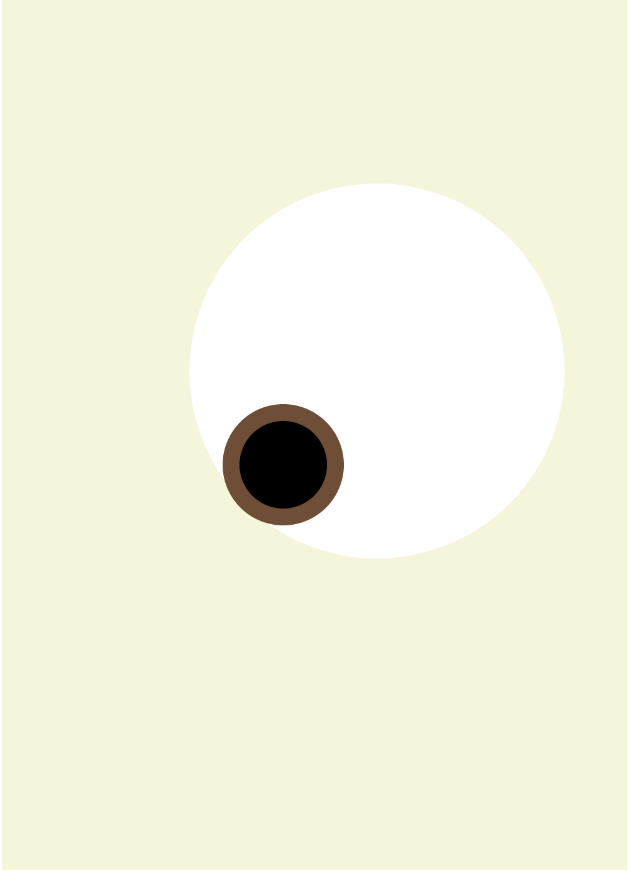
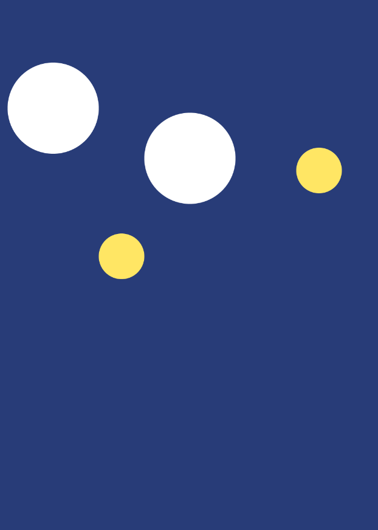

# Nicolas Robledo S.

## About this page

Here I will keep the work I do for my CART253 class.

## Links

* [My journal](journal.md)

## My work

* Project Variables

Flowers Blooming

[View this project online](https://nic0roble.github.io/CART253/prototypes/instructions/prototype.3.weird/)

Sad Face

[View this project online](https://nic0roble.github.io/CART253/variables-prototype-1/variables/sad.circle/)

Watching Eye

[View this project online](https://nic0roble.github.io/CART253/variables-prototype-1/variables/eye.that.moves/)

* Project Conditionals

Falling Stars

[View this project online](https://nic0roble.github.io/CART253/prototypes/instructions/prototype.3.weird/)

Scary Cat

[View this project online](https://nic0roble.github.io/CART253/conditional.homework/Scary.Cat/)

Lottery

[View this project online](https://nic0roble.github.io/CART253/conditional.homework/Lottery/)